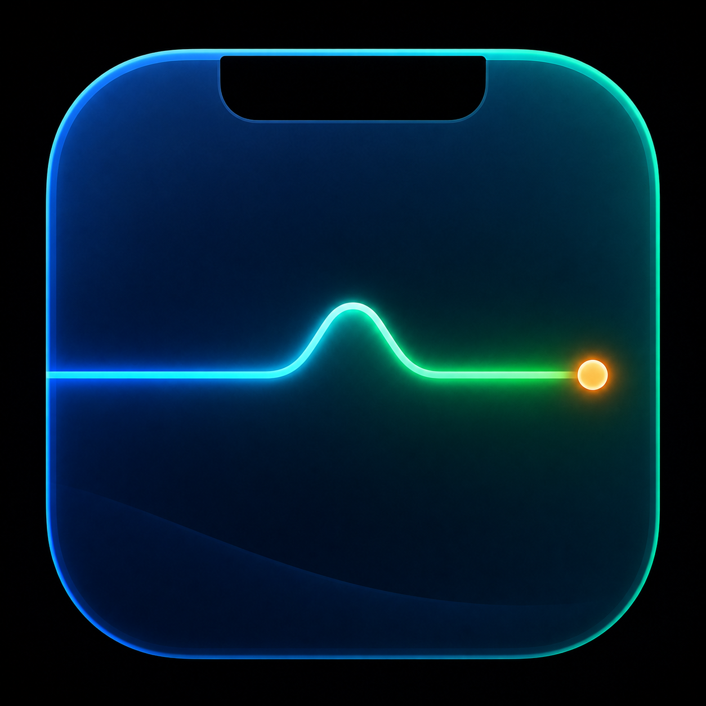

<p align="center">
  
</p>
<h1 align="center">Work Tempo</h1>
<p align="center"><strong>看见工作的节奏</strong></p>
<p align="center">macOS 刘海屏上的桌面工作台 · 实时收益 · 日程待办 · 快捷启动</p>

Work Tempo 将 MacBook 刘海区域变成随用随开的桌面工作台。查看今日收益与日程，快速打开常用应用、网站和文件，完成截图录屏与文件暂存，让日常高频操作集中在一个入口。

平时静默显示必要信息，悬停时展开工具，需要操作时通过按钮或快捷键打开面板。

## 主要功能

- **实时收益**：根据薪资、作息和工作日设置，展示持续更新的当日收益、工作进度与历史记录；支持调整数字颜色。
- **工作日历与日程待办**：设置工作日、休息日、请假、临时工作日和自定义工时；创建、查看、修改和删除日程及待办事项。
- **快捷启动**：搜索并打开应用、网站、文件和文件夹，支持拖放添加、图标识别、快捷键配置、配置导入导出与重启恢复。
- **截图录屏**：提供区域、窗口和全屏截图，以及区域和全屏录制，支持自定义快捷键及录制声音设置。
- **随手工具**：文件暂存、剪贴板、取色器、计时器和终端。
- **状态与控制**：媒体播放控制、系统状态、锁屏小组件，以及 AI 工具用量查看。
- **外观与交互**：调整布局、动画、悬停行为、手势和各功能开关。

## 从哪里打开

1. 将鼠标移到刘海区域，悬停展开工作台。
2. 点击展开区域顶部的键盘形 **Launcher** 按钮，打开快捷启动面板；也可按 **Control + Option + Q**。
3. 面板还可从 **Work Tempo 菜单栏菜单 → Quick Launcher**，或 **设置 → Shortcuts → Quick Launcher** 打开，不必只依赖快捷键。
4. 在对应标签中查看收益、日程、媒体、系统状态、剪贴板等内容；在设置页调整作息、布局和快捷键。

向文件暂存区添加文件也可以使用：

```bash
open -a "Work Tempo" /path/to/file
```

## 运行要求

- macOS 14.6 或更高版本。
- 主要面向带刘海的 MacBook；本项目是 macOS 应用，不是 iPhone 或 Windows 应用。
- 从源码构建需要 Xcode 16 或更高版本及 Swift 6 工具链。
- 根据启用的功能，按需授予辅助功能、日历、提醒事项、屏幕录制、麦克风、相机或自动化权限。

## 获取与构建

**当前提供源码，尚未提供经本项目正式签名并完成 Apple 公证的安装包，也未在 Mac App Store 上架。** GitHub 的源码 ZIP 不是可直接安装的 macOS 应用。

```bash
git clone --branch main --single-branch https://github.com/miseon-stack/work-tempo.git
cd work-tempo
open DynamicIsland.xcodeproj
```

在 Xcode 中选择 `DynamicIsland` scheme，选择自己的开发团队后构建运行。构建产物为 **Work Tempo.app**；项目和 scheme 的内部名称保留不变。

仓库内的图片、动画等资源均为普通 Git 文件，正常克隆或使用 **Code → Download ZIP** 即可取得完整源码，无需 Git LFS。

<a id="data-and-permissions"></a>
## 数据与权限

- 薪资、工作日、偏好设置和快捷启动配置默认保存在本机。
- 文件访问按用户选择和功能需要处理；快捷启动支持配置导入导出及恢复。
- 日历、屏幕录制、麦克风等权限仅在使用对应功能时需要；拒绝某项权限可能使该项功能不可用。
- 启用 AI、天气、媒体服务或其他联网功能时，会涉及相应服务的数据请求；“本地保存配置”不代表所有功能都离线运行。
- 本次从旧名称更名为 Work Tempo，继续使用原有 Bundle ID、设置和数据目录，避免收益或快捷启动配置被读取成空白。历史目录中的 `Atoll` 字样属于兼容保留，不是另一款应用。详见[品牌与兼容约定](docs/branding.md)。
- macOS 在应用重新构建或路径改变后可能要求重新确认部分权限；请按系统提示处理。

## 常见问题

- **快捷键没有反应**：先点击刘海顶部 Launcher 按钮或菜单栏入口，再检查快捷键设置与冲突。
- **授权后仍无法截图或录屏**：退出并重新打开 Work Tempo 后重试。
- **系统状态为空**：在设置的 Stats 页面启用对应类别。
- **媒体没有响应**：确认播放器正在运行，并已授予对应控制权限。
- **更名后仍看到旧目录名**：这是为了保留既有数据，不需要手动移动或删除。不要将 Debug 与 Release 的独立配置身份混用。

## 项目文档

- [产品需求文档](docs/Atoll_PRD_zh-CN.md)
- [第一阶段验收记录](docs/%E4%B8%80%E6%9C%9F%E9%AA%8C%E6%94%B6%E6%B8%85%E5%8D%95.md)
- [第二阶段验收记录](docs/%E4%BA%8C%E6%9C%9F%E9%AA%8C%E6%94%B6%E6%B8%85%E5%8D%95.md)
- [快捷启动模块开发与升级说明](docs/shortcut-launcher-integration.md)
- [品牌、图标与兼容约定](docs/branding.md)
- [安全漏洞报告](SECURITY.md)
- [变更记录](CHANGELOG.md)

部分早期技术文档保留历史名称与验证环境；当前产品品牌以本页和品牌约定为准。

## 开源与致谢

Work Tempo 由 **miseon-stack** 维护，基于 [Ebullioscopic/Atoll](https://github.com/Ebullioscopic/Atoll) 修改开发，并按 [GNU GPL v3.0](LICENSE) 发布。原项目作者、许可证和第三方致谢予以保留；上游历史及贡献记录可在[原仓库](https://github.com/Ebullioscopic/Atoll/graphs/contributors)查看。

项目修改及所含 ShortcutLauncher 集成版权所有 © 2026 miseon-stack。完整来源、组件和素材说明见 [NOTICE](NOTICE) 与 [MODIFICATIONS.md](MODIFICATIONS.md)。Work Tempo 使用为本项目生成并由维护者确认的独立图标，不使用上游 Atoll 图标作为产品标识。

本项目及其上游使用或借鉴了以下项目：

- [Boring.Notch](https://github.com/TheBoredTeam/boring.notch)：基础代码、媒体、AirDrop、文件暂存和日历交互。
- [Alcove](https://tryalcove.com)：简洁界面与锁屏组件设计灵感。
- [Stats](https://github.com/exelban/stats)：系统指标采集相关实现。
- [Open Meteo](https://open-meteo.com)：天气接口。
- [SkyLightWindow](https://github.com/Lakr233/SkyLightWindow)：锁屏窗口呈现。
- [rtaudio](https://github.com/ZephyrCodesStuff/rtaudio)：实时音乐可视化。
- [SwiftTerm](https://github.com/migueldeicaza/SwiftTerm)：终端功能。
- [DynamicNotch](https://github.com/jackson-storm/DynamicNotch)：电池 HUD。
- Wick / Nate：锁屏计时器设计参考及许可。
- [OpenUsage](https://github.com/robinebers/openusage)：LLM 使用量跟踪。
- [OpenRouter](https://openrouter.ai)：模型价格接口。

上游 Atoll 的支持方包括 iOS Development Centre（SRM Institute of Science and Technology, Chennai；其上游资料注明 Powered by Apple and Infosys）。这不是对 Work Tempo 的新增赞助或背书声明。若希望支持原项目，可访问[上游赞助页面](https://buymeacoffee.com/kryoscopic)。
